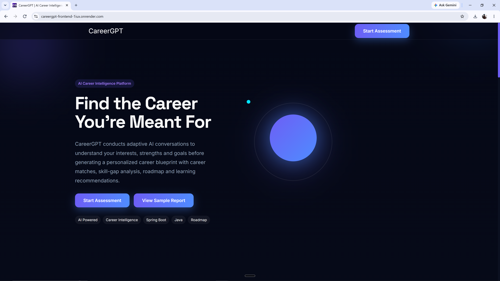
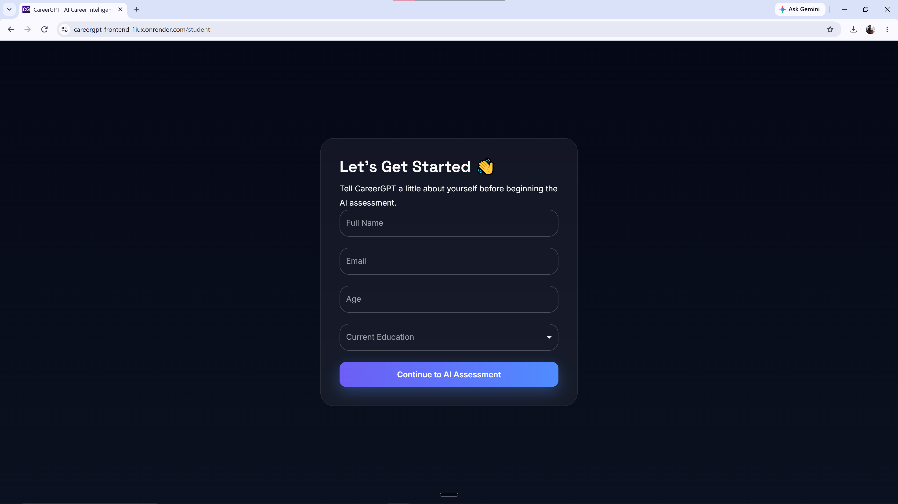
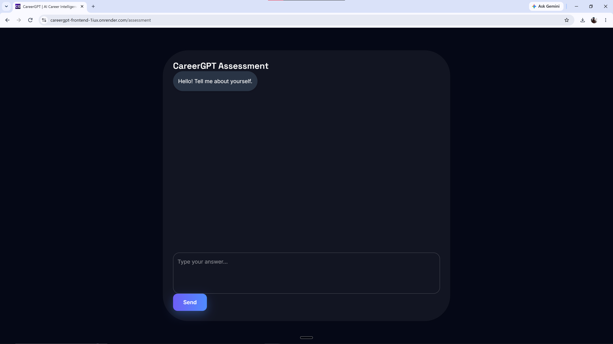

# 🚀 CareerGPT – AI Career Intelligence Platform

CareerGPT is a full-stack AI-powered career assessment platform that conducts an interactive interview, analyzes user responses using **Google Gemini AI**, and generates a comprehensive personalized career report with career recommendations, skill analysis, learning roadmap, and downloadable PDF reports.

Designed to simulate a real career counseling session, CareerGPT helps students and job seekers understand their strengths, suitable career paths, and areas for improvement through conversational AI.

---

## 🌐 Live Demo

**🔗 Try CareerGPT Here**

https://careergpt-frontend-1iux.onrender.com/

> **Note:** This project is hosted on Render's free tier. The first request after inactivity may take 30–60 seconds while the backend services wake up. :contentReference[oaicite:0]{index=0}

---

# 📸 Screenshots

> *(Add screenshots here after uploading them to GitHub)*



---



---



---

# ✨ Features

- 🤖 AI-powered conversational career assessment
- 💬 Interactive multi-step interview
- 🧠 Google Gemini AI integration
- 📊 Personalized career report generation
- 🎯 Career recommendations based on responses
- 📚 Skill gap analysis
- 🛣 Personalized learning roadmap
- 💼 Career match suggestions
- 📄 Downloadable PDF report
- 🔐 Session-based conversation history
- 📱 Fully responsive UI
- ☁️ Cloud deployed using Render

---

# 🛠 Tech Stack

## Frontend

- React
- Vite
- Material UI
- Axios
- React Router

---

## Backend

- Spring Boot
- Spring Data JPA
- Hibernate
- PostgreSQL
- RestTemplate

---

## AI Service

- FastAPI
- Google Gemini API
- Python
- Pydantic

---

## Database

- PostgreSQL

---

## Deployment

- Render (Frontend)
- Render (Backend)
- Render (AI Service)

---

# 🏗 System Architecture

```
                React Frontend
                       │
                       ▼
              Spring Boot Backend
                       │
                       ▼
            FastAPI AI Microservice
                       │
                       ▼
               Google Gemini AI
                       │
                       ▼
                 Career Report
                       │
                       ▼
                 PostgreSQL Database
```

---

# 🚀 Project Workflow

1. User enters personal details.
2. Backend creates a new assessment session.
3. AI asks one question at a time.
4. User answers each question.
5. Conversation history is stored in PostgreSQL.
6. Backend forwards the conversation to the FastAPI AI service.
7. Gemini analyzes responses.
8. After the assessment is complete, Gemini generates a structured JSON career report.
9. Backend stores the report.
10. Frontend displays the report and allows PDF download.

---

# 📂 Project Structure

```
CareerGPT
│
├── careergpt-frontend
│   ├── React
│   ├── Material UI
│   └── Vite
│
├── careergpt-backend
│   ├── Spring Boot
│   ├── PostgreSQL
│   └── REST APIs
│
└── careergpt-ai
    ├── FastAPI
    ├── Gemini AI
    └── Prompt Engineering
```

---

# 🧠 AI Capabilities

CareerGPT uses Google's Gemini AI to:

- Conduct conversational interviews
- Ask contextual follow-up questions
- Analyze user responses
- Identify strengths and weaknesses
- Recommend suitable careers
- Generate structured career reports
- Suggest learning resources and roadmaps

---

# 📑 Generated Career Report Includes

- Executive Summary
- Candidate Snapshot
- Top Career Matches
- Strength Analysis
- Areas of Improvement
- Recommended Skills
- Learning Roadmap
- Certifications
- Project Suggestions
- Salary Expectations
- Final Career Advice

---

# ⚙️ Running Locally

## Clone the repository

```bash
git clone https://github.com/jishnu395/CareerGPT.git
```

---

## Frontend

```bash
cd careergpt-frontend

npm install

npm run dev
```

---

## Backend

```bash
cd careergpt-backend

./mvnw spring-boot:run
```

---

## AI Service

```bash
cd careergpt-ai

pip install -r requirements.txt

uvicorn main:app --reload
```

---

# 🔑 Environment Variables

### Backend

```
AI_SERVICE_URL
DATABASE_URL
DB_USERNAME
DB_PASSWORD
```

### AI Service

```
GEMINI_API_KEY
```

---

# 📌 Future Improvements

- User Authentication (JWT)
- Resume Analyzer
- ATS Resume Score
- Job Recommendation Engine
- Company Fit Analysis
- Interview Preparation
- Mock Technical Interviews
- Dashboard Analytics
- Email Reports
- Multi-language Support

---

# 📖 Learning Outcomes

This project helped strengthen skills in:

- Full Stack Development
- Spring Boot REST APIs
- FastAPI Microservices
- React Development
- PostgreSQL
- Prompt Engineering
- Google Gemini AI Integration
- REST Communication
- JSON Processing
- Cloud Deployment
- Debugging Distributed Systems

---

# 👨‍💻 Author

**Jishnu V**

Computer Science Engineering Student

Sir M Visvesvaraya Institute of Technology

LinkedIn:
https://www.linkedin.com/in/v-jishnu

GitHub:
https://github.com/jishnu395

---

# ⭐ If you like this project

Please consider giving it a ⭐ on GitHub!
